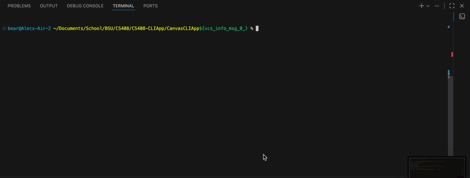

# Canvas CLI App

A Node.js CLI tool that queries your Canvas courses and assignments, displaying them in formatted terminal output. This tool simplifies course and assignment tracking by providing quick access to Canvas data directly from the command line.

## Demo



## Setup Instructions

### Step 1: Clone the Repository
```bash
git clone <repository-url>
cd CanvasCLIApp
```

### Step 2: Install Dependencies
```bash
npm install
```

### Step 3: Set Up Environment Variables
Copy the example environment file:
```bash
cp .env.example .env
```

### Step 4: Add Your Canvas API Token
1. Go to your Canvas account and log in
2. Navigate to Account > Settings
3. Scroll to "Approved Integrations" 
4. Click "New Access Token"
5. Copy the generated token
6. Open `.env` and fill in the values:

   ```
   CANVAS_API_TOKEN=your_token_here
   CANVAS_INSTANCE_URL=https://your-canvas-instance.instructure.com
   ```

### Step 5: Run the Tool
```bash
node index.js

# OR

node index.js <course number>

# Lists the Assignments of that course
```

## Example Commands and Output

### Example 1: List All Courses
```bash
$ node index.js

────────────────────────────────────────────────────────────────────────────────
ID             Course Name
────────────────────────────────────────────────────────────────────────────────
46024          CS 408 - Software Engineering
46025          CS 354 - Programming Languages
46026          MATH 361 - Probability and Statistics
────────────────────────────────────────────────────────────────────────────────

Total courses: 3
```

### Example 2: List Assignments for a Specific Course
```bash
$ node index.js 46024

────────────────────────────────────────────────────────────────────────────────────────────────────────────────────────────────────────────────────
ID        Name                                              Due Date                      Points
────────────────────────────────────────────────────────────────────────────────────────────────────────────────────────────────────────────────────
1001      Project Proposal                                  3/15/2026                     100
1002      Midterm Exam                                      3/20/2026                     200
1003      Final Project                                     4/10/2026                     300
────────────────────────────────────────────────────────────────────────────────────────────────────────────────────────────────────────────────────

Total assignments: 3
```

## API Endpoints Used

| Endpoint | Method | Purpose |
|----------|--------|---------|
| `/api/v1/courses` | GET | Retrieves list of all courses accessible to the user |
| `/api/v1/courses/:id/assignments` | GET | Retrieves all assignments for a specific course |

## Reflection

### What I Learned
Building this Canvas CLI tool deepened my understanding of API integration and pagination handling. I learned how to properly parse pagination headers and implement automatic page fetching, which is definitely needed for working with APIs. Additionally, I gained practical experience with environment variable management for secure credential storage.

### Challenges Faced
The primary challenge was implementing pagination correctly. Another challenge was linking the endpoints properly and figuring that out. I leaned on AI on help to understand and implement the endpoint part.

### Future Improvements
If I had more time, I would add interactive prompts to make the tool more user-friendly, such as not having to know the course ID in order to call the assignments. I would also expand the functionality to include more endpoints such as retrieving grades, displaying submission deadlines, and creating sort features where you can sort by certain things, such as grade impact, due dates, and graded vs non-graded.
